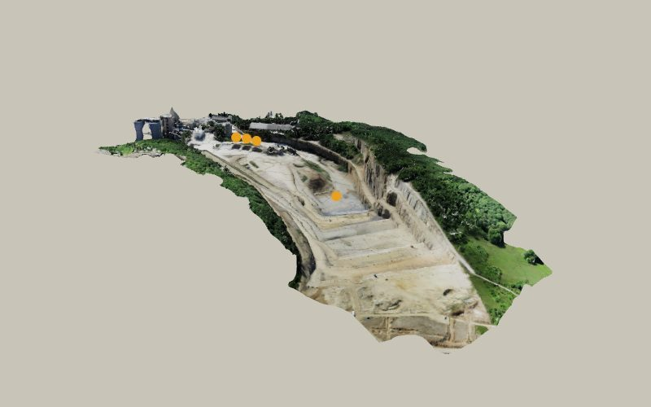
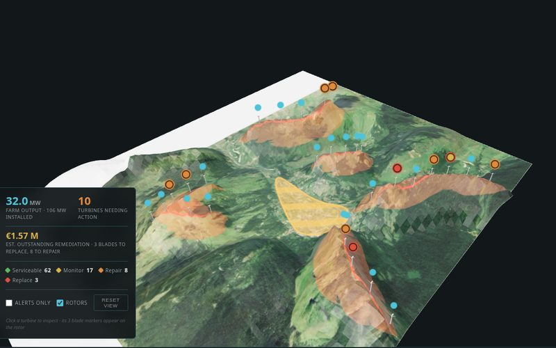
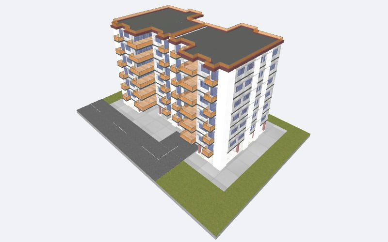
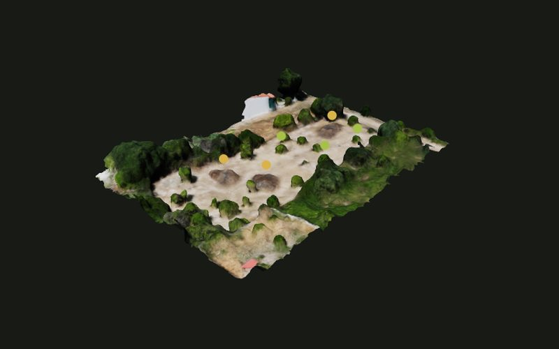
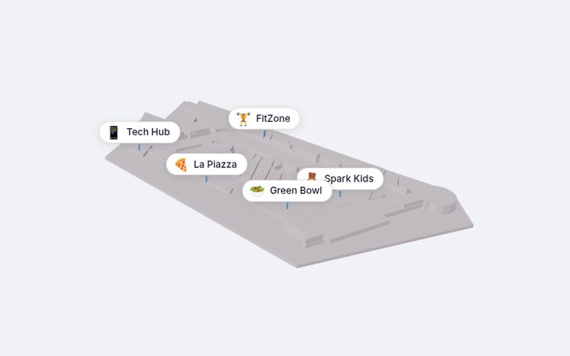
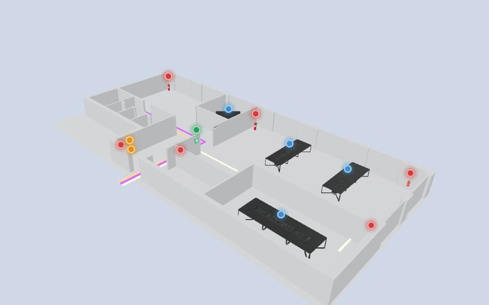
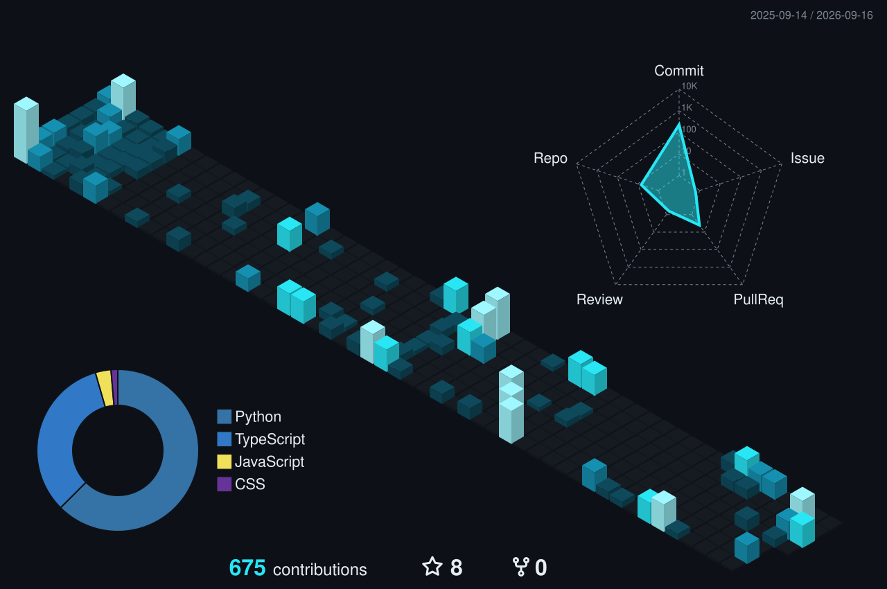

<!-- Header, 3D point cloud and mineral are generated by scripts/generate_assets.py -->
<p align="center">
  
</p>

<p align="center">
  <a href="https://github.com/VasilisKokotakis">
    
  </a>
</p>

<p align="center">
  <a href="https://www.linkedin.com/in/vasilis-kokotakis"></a>
  <a href="https://github.com/VasilisKokotakis?tab=followers"></a>
  
</p>

<br />

## `$ cat about_me.py`

```python
class Vasilis(SoftwareEngineer):
    from_      = "Greece"
    based_in   = "Poland"
    past_life  = "Mining & construction engineer"
    day_job    = "Backend systems & SaaS integrations"
    side_quest = "AEROMINE: drones, point clouds & 3D digital twins"
    stack      = ["Python", "FastAPI", "PostgreSQL", "Docker", "React", "Three.js"]
    motto      = "If I do it twice, I script it. Three times, I script it well."

    def debug(self, bug):
        return self.talk_to(bug, tone="like it owes me money")
```

## `$ ls ~/stack`

<p align="center">
  <br />
  <br />
  
</p>

## `$ cd ~/aeromine`

<p align="center">
  <a href="https://github.com/aeromineRnD">
    <picture>
      <source media="(prefers-color-scheme: dark)" srcset="assets/aeromine/logo-dark.png" />
      
    </picture>
  </a>
</p>

<p align="center">
  <b>R&D collaborator & developer at <a href="https://aeromine.gr">AEROMINE</a></b>: drone surveys turned into interactive 3D digital twins.<br />
  I build the web viewers and platforms at <a href="https://github.com/aeromineRnD">@aeromineRnD</a>, with <b>120+ commits across 10+ repos</b>.
</p>

<p align="center">
  <a href="https://github.com/aeromineRnD"></a>
  <a href="https://aeromine.gr"></a>
  <a href="https://aeromine-project-tracking-platform.vercel.app"></a>
</p>

<table>
  <tr>
    <td width="33%" align="center"><a href="https://aeromine-3d-open-pit.vercel.app"></a><br /><sub><b>Open Pit</b> · stockpile map</sub></td>
    <td width="33%" align="center"><a href="https://aeromine-3d-wind-turbines.vercel.app"></a><br /><sub><b>Wind Farm</b> · turbine & blade condition</sub></td>
    <td width="33%" align="center"><a href="https://aeromine-3d-real-estate.vercel.app"></a><br /><sub><b>Real Estate</b> · floor-by-floor viewer</sub></td>
  </tr>
  <tr>
    <td width="33%" align="center"><a href="https://aeromine-3-d-olive-trees-farm.vercel.app"></a><br /><sub><b>Olive Farm</b> · grove & materials map</sub></td>
    <td width="33%" align="center"><a href="https://aeromine-3d-mall-map.vercel.app"></a><br /><sub><b>Mall Map</b> · phased store directory</sub></td>
    <td width="33%" align="center"><a href="https://aeromine-3d-open-office.vercel.app"></a><br /><sub><b>Open Office</b> · fire-safety map</sub></td>
  </tr>
</table>

<p align="center"><sub>Click any scene to open the live 3D demo. Built with Three.js and Vite on top of drone photogrammetry.</sub></p>

## `$ ls ~/projects --featured`

<table>
  <tr>
    <td width="33%" valign="top">
      <h3><a href="https://github.com/VasilisKokotakis/AEROMINE-TRENCH-TOOL-V2">AEROMINE Trench Tool</a></h3>
      3D trench point-cloud analysis: cross-sections, wall distance and depth reports straight from LAS/LAZ files.<br /><br />
      <code>Python</code> <code>point clouds</code> <code>LAS/LAZ</code>
    </td>
    <td width="33%" valign="top">
      <h3><a href="https://github.com/VasilisKokotakis/backup-monitor-api">backup-monitor-api</a></h3>
      REST API that tracks SaaS backup job statuses across multiple clients.<br /><br />
      <code>FastAPI</code> <code>PostgreSQL</code> <code>JWT</code> <code>Docker</code>
    </td>
    <td width="33%" valign="top">
      <h3><a href="https://github.com/VasilisKokotakis/model-viewer">model-viewer</a></h3>
      Interactive 3D viewer for GLTF/GLB models, running in the browser.<br /><br />
      <code>React</code> <code>Three.js</code> <code>R3F</code>
    </td>
  </tr>
</table>

<sub>Also: <a href="https://github.com/VasilisKokotakis/Log-Analyzer">Log-Analyzer</a> (one-click API failure reports) · <a href="https://github.com/VasilisKokotakis/PDF-Converter-Tools">PDF-Converter-Tools</a> (CustomTkinter desktop utilities)</sub>

## `$ git log --graph --3d`

<p align="center">
  
</p>

<p align="center">
  
</p>

## `$ open mineral.stl`

<details>
<summary><b>Click to spin a 3D mineral</b> (drag to rotate, scroll to zoom, generated in Python)</summary>

<!-- STL:START -->
```stl
solid mineral
facet normal -0.41 0.90 0.13
outer loop
vertex -6.61 8.72 0.00
vertex -11.88 5.98 2.42
vertex -4.32 9.22 3.73
endloop
endfacet
facet normal -0.48 0.15 0.86
outer loop
vertex -11.39 0.00 3.76
vertex -6.71 3.38 5.79
vertex -11.88 5.98 2.42
endloop
endfacet
facet normal -0.04 0.35 0.94
outer loop
vertex 0.00 5.13 5.43
vertex -4.32 9.22 3.73
vertex -6.71 3.38 5.79
endloop
endfacet
facet normal -0.33 0.43 0.84
outer loop
vertex -11.88 5.98 2.42
vertex -6.71 3.38 5.79
vertex -4.32 9.22 3.73
endloop
endfacet
facet normal -0.37 0.92 0.10
outer loop
vertex -6.61 8.72 0.00
vertex -4.32 9.22 3.73
vertex 0.00 11.39 0.00
endloop
endfacet
facet normal 0.12 0.48 0.87
outer loop
vertex 0.00 5.13 5.43
vertex 3.79 8.09 3.27
vertex -4.32 9.22 3.73
endloop
endfacet
facet normal 0.21 0.80 0.56
outer loop
vertex 7.18 9.46 0.00
vertex 0.00 11.39 0.00
vertex 3.79 8.09 3.27
endloop
endfacet
facet normal 0.14 0.78 0.62
outer loop
vertex -4.32 9.22 3.73
vertex 3.79 8.09 3.27
vertex 0.00 11.39 0.00
endloop
endfacet
facet normal -0.37 0.91 -0.19
outer loop
vertex -6.61 8.72 0.00
vertex 0.00 11.39 0.00
vertex -4.20 8.95 -3.62
endloop
endfacet
facet normal 0.26 0.96 -0.10
outer loop
vertex 7.18 9.46 0.00
vertex 4.57 9.75 -3.94
vertex 0.00 11.39 0.00
endloop
endfacet
facet normal -0.09 0.69 -0.72
outer loop
vertex 0.00 6.29 -6.66
vertex -4.20 8.95 -3.62
vertex 4.57 9.75 -3.94
endloop
endfacet
facet normal -0.10 0.87 -0.48
outer loop
vertex 0.00 11.39 0.00
vertex 4.57 9.75 -3.94
vertex -4.20 8.95 -3.62
endloop
endfacet
facet normal -0.43 0.87 -0.23
outer loop
vertex -6.61 8.72 0.00
vertex -4.20 8.95 -3.62
vertex -11.41 5.75 -2.32
endloop
endfacet
facet normal -0.25 0.53 -0.81
outer loop
vertex 0.00 6.29 -6.66
vertex -7.17 3.61 -6.19
vertex -4.20 8.95 -3.62
endloop
endfacet
facet normal -0.50 0.40 -0.77
outer loop
vertex -12.96 0.00 -4.27
vertex -11.41 5.75 -2.32
vertex -7.17 3.61 -6.19
endloop
endfacet
facet normal -0.38 0.56 -0.73
outer loop
vertex -4.20 8.95 -3.62
vertex -7.17 3.61 -6.19
vertex -11.41 5.75 -2.32
endloop
endfacet
facet normal -0.49 0.87 -0.09
outer loop
vertex -6.61 8.72 0.00
vertex -11.41 5.75 -2.32
vertex -11.88 5.98 2.42
endloop
endfacet
facet normal -0.96 0.18 0.22
outer loop
vertex -12.96 0.00 -4.27
vertex -11.97 0.00 0.00
vertex -11.41 5.75 -2.32
endloop
endfacet
facet normal -0.99 -0.05 0.15
outer loop
vertex -11.39 0.00 3.76
vertex -11.88 5.98 2.42
vertex -11.97 0.00 0.00
endloop
endfacet
facet normal -0.99 0.06 -0.10
outer loop
vertex -11.41 5.75 -2.32
vertex -11.97 0.00 0.00
vertex -11.88 5.98 2.42
endloop
endfacet
facet normal 0.32 0.71 0.63
outer loop
vertex 7.18 9.46 0.00
vertex 3.79 8.09 3.27
vertex 11.18 5.63 2.28
endloop
endfacet
facet normal 0.03 0.57 0.82
outer loop
vertex 0.00 5.13 5.43
vertex 7.20 3.63 6.22
vertex 3.79 8.09 3.27
endloop
endfacet
facet normal 0.67 0.10 0.73
outer loop
vertex 10.69 0.00 3.52
vertex 11.18 5.63 2.28
vertex 7.20 3.63 6.22
endloop
endfacet
facet normal 0.32 0.68 0.66
outer loop
vertex 3.79 8.09 3.27
vertex 7.20 3.63 6.22
vertex 11.18 5.63 2.28
endloop
endfacet
facet normal 0.01 0.17 0.99
outer loop
vertex 0.00 5.13 5.43
vertex -6.71 3.38 5.79
vertex 0.00 0.00 6.32
endloop
endfacet
facet normal -0.36 -0.05 0.93
outer loop
vertex -11.39 0.00 3.76
vertex -6.40 -3.22 5.52
vertex -6.71 3.38 5.79
endloop
endfacet
facet normal -0.12 0.00 0.99
outer loop
vertex 0.00 -5.97 6.32
vertex 0.00 0.00 6.32
vertex -6.40 -3.22 5.52
endloop
endfacet
facet normal -0.10 -0.04 0.99
outer loop
vertex -6.71 3.38 5.79
vertex -6.40 -3.22 5.52
vertex 0.00 0.00 6.32
endloop
endfacet
facet normal -0.98 -0.14 0.15
outer loop
vertex -11.39 0.00 3.76
vertex -11.97 0.00 0.00
vertex -10.84 -5.46 2.21
endloop
endfacet
facet normal -0.97 -0.09 0.23
outer loop
vertex -12.96 0.00 -4.27
vertex -11.96 -6.02 -2.44
vertex -11.97 0.00 0.00
endloop
endfacet
facet normal -0.58 -0.78 0.23
outer loop
vertex -6.86 -9.04 0.00
vertex -10.84 -5.46 2.21
vertex -11.96 -6.02 -2.44
endloop
endfacet
facet normal -0.96 -0.10 0.24
outer loop
vertex -11.97 0.00 0.00
vertex -11.96 -6.02 -2.44
vertex -10.84 -5.46 2.21
endloop
endfacet
facet normal -0.34 0.04 -0.94
outer loop
vertex -12.96 0.00 -4.27
vertex -7.17 3.61 -6.19
vertex -7.41 -3.73 -6.40
endloop
endfacet
facet normal -0.12 0.15 -0.98
outer loop
vertex 0.00 6.29 -6.66
vertex 0.00 0.00 -7.61
vertex -7.17 3.61 -6.19
endloop
endfacet
facet normal 0.06 -0.41 -0.91
outer loop
vertex 0.00 -5.05 -5.35
vertex -7.41 -3.73 -6.40
vertex 0.00 0.00 -7.61
endloop
endfacet
facet normal -0.18 0.03 -0.98
outer loop
vertex -7.17 3.61 -6.19
vertex 0.00 0.00 -7.61
vertex -7.41 -3.73 -6.40
endloop
endfacet
facet normal 0.18 0.45 -0.87
outer loop
vertex 0.00 6.29 -6.66
vertex 4.57 9.75 -3.94
vertex 7.49 3.77 -6.46
endloop
endfacet
facet normal 0.52 0.80 -0.29
outer loop
vertex 7.18 9.46 0.00
vertex 11.53 5.81 -2.35
vertex 4.57 9.75 -3.94
endloop
endfacet
facet normal 0.70 0.06 -0.71
outer loop
vertex 10.77 0.00 -3.55
vertex 7.49 3.77 -6.46
vertex 11.53 5.81 -2.35
endloop
endfacet
facet normal 0.46 0.53 -0.71
outer loop
vertex 4.57 9.75 -3.94
vertex 11.53 5.81 -2.35
vertex 7.49 3.77 -6.46
endloop
endfacet
facet normal 0.47 -0.66 0.58
outer loop
vertex 7.29 -9.61 0.00
vertex 10.62 -5.35 2.16
vertex 4.11 -8.77 3.55
endloop
endfacet
facet normal 0.73 -0.18 0.66
outer loop
vertex 10.69 0.00 3.52
vertex 7.28 -3.67 6.28
vertex 10.62 -5.35 2.16
endloop
endfacet
facet normal 0.18 -0.55 0.82
outer loop
vertex 0.00 -5.97 6.32
vertex 4.11 -8.77 3.55
vertex 7.28 -3.67 6.28
endloop
endfacet
facet normal 0.46 -0.62 0.63
outer loop
vertex 10.62 -5.35 2.16
vertex 7.28 -3.67 6.28
vertex 4.11 -8.77 3.55
endloop
endfacet
facet normal 0.29 -0.84 0.46
outer loop
vertex 7.29 -9.61 0.00
vertex 4.11 -8.77 3.55
vertex 0.00 -12.08 0.00
endloop
endfacet
facet normal 0.12 -0.60 0.79
outer loop
vertex 0.00 -5.97 6.32
vertex -4.64 -9.91 4.01
vertex 4.11 -8.77 3.55
endloop
endfacet
facet normal -0.41 -0.91 0.03
outer loop
vertex -6.86 -9.04 0.00
vertex 0.00 -12.08 0.00
vertex -4.64 -9.91 4.01
endloop
endfacet
facet normal 0.13 -0.80 0.59
outer loop
vertex 4.11 -8.77 3.55
vertex -4.64 -9.91 4.01
vertex 0.00 -12.08 0.00
endloop
endfacet
facet normal 0.25 -0.74 -0.62
outer loop
vertex 7.29 -9.61 0.00
vertex 0.00 -12.08 0.00
vertex 3.78 -8.06 -3.26
endloop
endfacet
facet normal -0.33 -0.75 -0.57
outer loop
vertex -6.86 -9.04 0.00
vertex -3.74 -7.97 -3.22
vertex 0.00 -12.08 0.00
endloop
endfacet
facet normal -0.01 -0.58 -0.81
outer loop
vertex 0.00 -5.05 -5.35
vertex 3.78 -8.06 -3.26
vertex -3.74 -7.97 -3.22
endloop
endfacet
facet normal -0.01 -0.62 -0.78
outer loop
vertex 0.00 -12.08 0.00
vertex -3.74 -7.97 -3.22
vertex 3.78 -8.06 -3.26
endloop
endfacet
facet normal 0.23 -0.76 -0.61
outer loop
vertex 7.29 -9.61 0.00
vertex 3.78 -8.06 -3.26
vertex 12.24 -6.17 -2.49
endloop
endfacet
facet normal 0.13 -0.45 -0.88
outer loop
vertex 0.00 -5.05 -5.35
vertex 6.25 -3.15 -5.40
vertex 3.78 -8.06 -3.26
endloop
endfacet
facet normal 0.41 -0.06 -0.91
outer loop
vertex 10.77 0.00 -3.55
vertex 12.24 -6.17 -2.49
vertex 6.25 -3.15 -5.40
endloop
endfacet
facet normal 0.18 -0.47 -0.86
outer loop
vertex 3.78 -8.06 -3.26
vertex 6.25 -3.15 -5.40
vertex 12.24 -6.17 -2.49
endloop
endfacet
facet normal 0.65 -0.68 0.34
outer loop
vertex 7.29 -9.61 0.00
vertex 12.24 -6.17 -2.49
vertex 10.62 -5.35 2.16
endloop
endfacet
facet normal 0.81 0.10 -0.57
outer loop
vertex 10.77 0.00 -3.55
vertex 13.28 0.00 0.00
vertex 12.24 -6.17 -2.49
endloop
endfacet
facet normal 0.80 -0.16 0.58
outer loop
vertex 10.69 0.00 3.52
vertex 10.62 -5.35 2.16
vertex 13.28 0.00 0.00
endloop
endfacet
facet normal 0.89 -0.29 0.36
outer loop
vertex 12.24 -6.17 -2.49
vertex 13.28 0.00 0.00
vertex 10.62 -5.35 2.16
endloop
endfacet
facet normal 0.01 0.00 1.00
outer loop
vertex 0.00 -5.97 6.32
vertex 7.28 -3.67 6.28
vertex 0.00 0.00 6.32
endloop
endfacet
facet normal 0.62 0.01 0.78
outer loop
vertex 10.69 0.00 3.52
vertex 7.20 3.63 6.22
vertex 7.28 -3.67 6.28
endloop
endfacet
facet normal -0.07 0.17 0.98
outer loop
vertex 0.00 5.13 5.43
vertex 0.00 0.00 6.32
vertex 7.20 3.63 6.22
endloop
endfacet
facet normal 0.01 0.01 1.00
outer loop
vertex 7.28 -3.67 6.28
vertex 7.20 3.63 6.22
vertex 0.00 0.00 6.32
endloop
endfacet
facet normal -0.61 -0.78 0.17
outer loop
vertex -6.86 -9.04 0.00
vertex -4.64 -9.91 4.01
vertex -10.84 -5.46 2.21
endloop
endfacet
facet normal -0.23 -0.27 0.93
outer loop
vertex 0.00 -5.97 6.32
vertex -6.40 -3.22 5.52
vertex -4.64 -9.91 4.01
endloop
endfacet
facet normal -0.48 -0.28 0.83
outer loop
vertex -11.39 0.00 3.76
vertex -10.84 -5.46 2.21
vertex -6.40 -3.22 5.52
endloop
endfacet
facet normal -0.46 -0.31 0.83
outer loop
vertex -4.64 -9.91 4.01
vertex -6.40 -3.22 5.52
vertex -10.84 -5.46 2.21
endloop
endfacet
facet normal 0.01 -0.60 -0.80
outer loop
vertex 0.00 -5.05 -5.35
vertex -3.74 -7.97 -3.22
vertex -7.41 -3.73 -6.40
endloop
endfacet
facet normal -0.24 -0.82 -0.51
outer loop
vertex -6.86 -9.04 0.00
vertex -11.96 -6.02 -2.44
vertex -3.74 -7.97 -3.22
endloop
endfacet
facet normal -0.52 -0.33 -0.79
outer loop
vertex -12.96 0.00 -4.27
vertex -7.41 -3.73 -6.40
vertex -11.96 -6.02 -2.44
endloop
endfacet
facet normal -0.23 -0.70 -0.67
outer loop
vertex -3.74 -7.97 -3.22
vertex -11.96 -6.02 -2.44
vertex -7.41 -3.73 -6.40
endloop
endfacet
facet normal 0.50 -0.22 -0.84
outer loop
vertex 10.77 0.00 -3.55
vertex 6.25 -3.15 -5.40
vertex 7.49 3.77 -6.46
endloop
endfacet
facet normal 0.12 -0.41 -0.91
outer loop
vertex 0.00 -5.05 -5.35
vertex 0.00 0.00 -7.61
vertex 6.25 -3.15 -5.40
endloop
endfacet
facet normal 0.08 0.15 -0.99
outer loop
vertex 0.00 6.29 -6.66
vertex 7.49 3.77 -6.46
vertex 0.00 0.00 -7.61
endloop
endfacet
facet normal 0.24 -0.19 -0.95
outer loop
vertex 6.25 -3.15 -5.40
vertex 0.00 0.00 -7.61
vertex 7.49 3.77 -6.46
endloop
endfacet
facet normal 0.80 0.06 0.59
outer loop
vertex 10.69 0.00 3.52
vertex 13.28 0.00 0.00
vertex 11.18 5.63 2.28
endloop
endfacet
facet normal 0.82 0.01 -0.58
outer loop
vertex 10.77 0.00 -3.55
vertex 11.53 5.81 -2.35
vertex 13.28 0.00 0.00
endloop
endfacet
facet normal 0.67 0.74 0.08
outer loop
vertex 7.18 9.46 0.00
vertex 11.18 5.63 2.28
vertex 11.53 5.81 -2.35
endloop
endfacet
facet normal 0.94 0.32 0.08
outer loop
vertex 13.28 0.00 0.00
vertex 11.53 5.81 -2.35
vertex 11.18 5.63 2.28
endloop
endfacet
facet normal -0.65 0.76 0.02
outer loop
vertex 0.45 2.74 1.81
vertex -1.63 0.92 2.30
vertex 0.22 2.16 14.60
endloop
endfacet
facet normal -0.65 0.76 0.02
outer loop
vertex 0.45 2.74 1.81
vertex 0.22 2.16 14.60
vertex 2.30 3.97 14.11
endloop
endfacet
facet normal -0.51 0.71 0.49
outer loop
vertex 2.30 3.97 14.11
vertex 0.22 2.16 14.60
vertex 3.51 1.67 18.71
endloop
endfacet
facet normal -0.97 -0.18 0.16
outer loop
vertex -1.63 0.92 2.30
vertex -1.08 -1.81 2.49
vertex 0.77 -0.58 14.79
endloop
endfacet
facet normal -0.97 -0.18 0.16
outer loop
vertex -1.63 0.92 2.30
vertex 0.77 -0.58 14.79
vertex 0.22 2.16 14.60
endloop
endfacet
facet normal -0.78 -0.11 0.61
outer loop
vertex 0.22 2.16 14.60
vertex 0.77 -0.58 14.79
vertex 3.51 1.67 18.71
endloop
endfacet
facet normal -0.31 -0.94 0.14
outer loop
vertex -1.08 -1.81 2.49
vertex 1.55 -2.74 2.19
vertex 3.40 -1.51 14.49
endloop
endfacet
facet normal -0.31 -0.94 0.14
outer loop
vertex -1.08 -1.81 2.49
vertex 3.40 -1.51 14.49
vertex 0.77 -0.58 14.79
endloop
endfacet
facet normal -0.21 -0.78 0.59
outer loop
vertex 0.77 -0.58 14.79
vertex 3.40 -1.51 14.49
vertex 3.51 1.67 18.71
endloop
endfacet
facet normal 0.65 -0.76 -0.02
outer loop
vertex 1.55 -2.74 2.19
vertex 3.63 -0.92 1.70
vertex 5.47 0.31 14.00
endloop
endfacet
facet normal 0.65 -0.76 -0.02
outer loop
vertex 1.55 -2.74 2.19
vertex 5.47 0.31 14.00
vertex 3.40 -1.51 14.49
endloop
endfacet
facet normal 0.65 -0.62 0.45
outer loop
vertex 3.40 -1.51 14.49
vertex 5.47 0.31 14.00
vertex 3.51 1.67 18.71
endloop
endfacet
facet normal 0.97 0.18 -0.16
outer loop
vertex 3.63 -0.92 1.70
vertex 3.08 1.81 1.51
vertex 4.92 3.04 13.81
endloop
endfacet
facet normal 0.97 0.18 -0.16
outer loop
vertex 3.63 -0.92 1.70
vertex 4.92 3.04 13.81
vertex 5.47 0.31 14.00
endloop
endfacet
facet normal 0.92 0.21 0.32
outer loop
vertex 5.47 0.31 14.00
vertex 4.92 3.04 13.81
vertex 3.51 1.67 18.71
endloop
endfacet
facet normal 0.31 0.94 -0.14
outer loop
vertex 3.08 1.81 1.51
vertex 0.45 2.74 1.81
vertex 2.30 3.97 14.11
endloop
endfacet
facet normal 0.31 0.94 -0.14
outer loop
vertex 3.08 1.81 1.51
vertex 2.30 3.97 14.11
vertex 4.92 3.04 13.81
endloop
endfacet
facet normal 0.35 0.87 0.34
outer loop
vertex 4.92 3.04 13.81
vertex 2.30 3.97 14.11
vertex 3.51 1.67 18.71
endloop
endfacet
facet normal -0.54 0.68 -0.50
outer loop
vertex -4.73 4.37 0.82
vertex -6.13 2.99 0.45
vertex -10.09 5.15 7.66
endloop
endfacet
facet normal -0.54 0.68 -0.50
outer loop
vertex -4.73 4.37 0.82
vertex -10.09 5.15 7.66
vertex -8.69 6.53 8.02
endloop
endfacet
facet normal -0.69 0.72 -0.04
outer loop
vertex -8.69 6.53 8.02
vertex -10.09 5.15 7.66
vertex -9.95 5.47 11.41
endloop
endfacet
facet normal -0.88 -0.26 -0.41
outer loop
vertex -6.13 2.99 0.45
vertex -5.91 1.13 1.14
vertex -9.87 3.29 8.34
endloop
endfacet
facet normal -0.88 -0.26 -0.41
outer loop
vertex -6.13 2.99 0.45
vertex -9.87 3.29 8.34
vertex -10.09 5.15 7.66
endloop
endfacet
facet normal -0.99 -0.10 0.05
outer loop
vertex -10.09 5.15 7.66
vertex -9.87 3.29 8.34
vertex -9.95 5.47 11.41
endloop
endfacet
facet normal -0.34 -0.94 0.09
outer loop
vertex -5.91 1.13 1.14
vertex -4.27 0.63 2.18
vertex -8.24 2.80 9.39
endloop
endfacet
facet normal -0.34 -0.94 0.09
outer loop
vertex -5.91 1.13 1.14
vertex -8.24 2.80 9.39
vertex -9.87 3.29 8.34
endloop
endfacet
facet normal -0.52 -0.70 0.49
outer loop
vertex -9.87 3.29 8.34
vertex -8.24 2.80 9.39
vertex -9.95 5.47 11.41
endloop
endfacet
facet normal 0.54 -0.68 0.50
outer loop
vertex -4.27 0.63 2.18
vertex -2.87 2.01 2.55
vertex -6.83 4.17 9.75
endloop
endfacet
facet normal 0.54 -0.68 0.50
outer loop
vertex -4.27 0.63 2.18
vertex -6.83 4.17 9.75
vertex -8.24 2.80 9.39
endloop
endfacet
facet normal 0.25 -0.48 0.84
outer loop
vertex -8.24 2.80 9.39
vertex -6.83 4.17 9.75
vertex -9.95 5.47 11.41
endloop
endfacet
facet normal 0.88 0.26 0.41
outer loop
vertex -2.87 2.01 2.55
vertex -3.09 3.87 1.86
vertex -7.05 6.04 9.06
endloop
endfacet
facet normal 0.88 0.26 0.41
outer loop
vertex -2.87 2.01 2.55
vertex -7.05 6.04 9.06
vertex -6.83 4.17 9.75
endloop
endfacet
facet normal 0.55 0.35 0.76
outer loop
vertex -6.83 4.17 9.75
vertex -7.05 6.04 9.06
vertex -9.95 5.47 11.41
endloop
endfacet
facet normal 0.34 0.94 -0.09
outer loop
vertex -3.09 3.87 1.86
vertex -4.73 4.37 0.82
vertex -8.69 6.53 8.02
endloop
endfacet
facet normal 0.34 0.94 -0.09
outer loop
vertex -3.09 3.87 1.86
vertex -8.69 6.53 8.02
vertex -7.05 6.04 9.06
endloop
endfacet
facet normal 0.08 0.94 0.32
outer loop
vertex -7.05 6.04 9.06
vertex -8.69 6.53 8.02
vertex -9.95 5.47 11.41
endloop
endfacet
facet normal 0.74 -0.37 -0.57
outer loop
vertex 6.19 -3.29 0.14
vertex 6.98 -1.79 0.19
vertex 10.43 -3.80 5.94
endloop
endfacet
facet normal 0.74 -0.37 -0.57
outer loop
vertex 6.19 -3.29 0.14
vertex 10.43 -3.80 5.94
vertex 9.64 -5.31 5.88
endloop
endfacet
facet normal 0.88 -0.46 -0.11
outer loop
vertex 9.64 -5.31 5.88
vertex 10.43 -3.80 5.94
vertex 10.29 -4.79 8.98
endloop
endfacet
facet normal 0.77 0.58 -0.26
outer loop
vertex 6.98 -1.79 0.19
vertex 6.29 -0.50 1.05
vertex 9.74 -2.51 6.80
endloop
endfacet
facet normal 0.77 0.58 -0.26
outer loop
vertex 6.98 -1.79 0.19
vertex 9.74 -2.51 6.80
vertex 10.43 -3.80 5.94
endloop
endfacet
facet normal 0.91 0.38 0.16
outer loop
vertex 10.43 -3.80 5.94
vertex 9.74 -2.51 6.80
vertex 10.29 -4.79 8.98
endloop
endfacet
facet normal 0.04 0.95 0.31
outer loop
vertex 6.29 -0.50 1.05
vertex 4.81 -0.71 1.86
vertex 8.26 -2.72 7.61
endloop
endfacet
facet normal 0.04 0.95 0.31
outer loop
vertex 6.29 -0.50 1.05
vertex 8.26 -2.72 7.61
vertex 9.74 -2.51 6.80
endloop
endfacet
facet normal 0.27 0.70 0.66
outer loop
vertex 9.74 -2.51 6.80
vertex 8.26 -2.72 7.61
vertex 10.29 -4.79 8.98
endloop
endfacet
facet normal -0.74 0.37 0.57
outer loop
vertex 4.81 -0.71 1.86
vertex 4.02 -2.21 1.81
vertex 7.47 -4.22 7.56
endloop
endfacet
facet normal -0.74 0.37 0.57
outer loop
vertex 4.81 -0.71 1.86
vertex 7.47 -4.22 7.56
vertex 8.26 -2.72 7.61
endloop
endfacet
facet normal -0.41 0.19 0.89
outer loop
vertex 8.26 -2.72 7.61
vertex 7.47 -4.22 7.56
vertex 10.29 -4.79 8.98
endloop
endfacet
facet normal -0.77 -0.58 0.26
outer loop
vertex 4.02 -2.21 1.81
vertex 4.71 -3.50 0.95
vertex 8.16 -5.52 6.70
endloop
endfacet
facet normal -0.77 -0.58 0.26
outer loop
vertex 4.02 -2.21 1.81
vertex 8.16 -5.52 6.70
vertex 7.47 -4.22 7.56
endloop
endfacet
facet normal -0.44 -0.65 0.62
outer loop
vertex 7.47 -4.22 7.56
vertex 8.16 -5.52 6.70
vertex 10.29 -4.79 8.98
endloop
endfacet
facet normal -0.04 -0.95 -0.31
outer loop
vertex 4.71 -3.50 0.95
vertex 6.19 -3.29 0.14
vertex 9.64 -5.31 5.88
endloop
endfacet
facet normal -0.04 -0.95 -0.31
outer loop
vertex 4.71 -3.50 0.95
vertex 9.64 -5.31 5.88
vertex 8.16 -5.52 6.70
endloop
endfacet
facet normal 0.20 -0.97 0.12
outer loop
vertex 8.16 -5.52 6.70
vertex 9.64 -5.31 5.88
vertex 10.29 -4.79 8.98
endloop
endfacet
facet normal -0.54 -0.73 -0.41
outer loop
vertex -1.16 -5.03 0.74
vertex -0.07 -5.61 0.33
vertex 0.15 -8.18 4.62
endloop
endfacet
facet normal -0.54 -0.73 -0.41
outer loop
vertex -1.16 -5.03 0.74
vertex 0.15 -8.18 4.62
vertex -0.94 -7.60 5.02
endloop
endfacet
facet normal -0.46 -0.89 0.05
outer loop
vertex -0.94 -7.60 5.02
vertex 0.15 -8.18 4.62
vertex 0.30 -8.14 7.07
endloop
endfacet
facet normal 0.45 -0.75 -0.48
outer loop
vertex -0.07 -5.61 0.33
vertex 1.09 -5.08 0.60
vertex 1.30 -7.65 4.88
endloop
endfacet
facet normal 0.45 -0.75 -0.48
outer loop
vertex -0.07 -5.61 0.33
vertex 1.30 -7.65 4.88
vertex 0.15 -8.18 4.62
endloop
endfacet
facet normal 0.42 -0.91 -0.01
outer loop
vertex 0.15 -8.18 4.62
vertex 1.30 -7.65 4.88
vertex 0.30 -8.14 7.07
endloop
endfacet
facet normal 1.00 -0.02 -0.06
outer loop
vertex 1.09 -5.08 0.60
vertex 1.16 -3.97 1.26
vertex 1.37 -6.54 5.54
endloop
endfacet
facet normal 1.00 -0.02 -0.06
outer loop
vertex 1.09 -5.08 0.60
vertex 1.37 -6.54 5.54
vertex 1.30 -7.65 4.88
endloop
endfacet
facet normal 0.90 -0.26 0.35
outer loop
vertex 1.30 -7.65 4.88
vertex 1.37 -6.54 5.54
vertex 0.30 -8.14 7.07
endloop
endfacet
facet normal 0.54 0.73 0.41
outer loop
vertex 1.16 -3.97 1.26
vertex 0.07 -3.39 1.67
vertex 0.28 -5.96 5.95
endloop
endfacet
facet normal 0.54 0.73 0.41
outer loop
vertex 1.16 -3.97 1.26
vertex 0.28 -5.96 5.95
vertex 1.37 -6.54 5.54
endloop
endfacet
facet normal 0.50 0.40 0.77
outer loop
vertex 1.37 -6.54 5.54
vertex 0.28 -5.96 5.95
vertex 0.30 -8.14 7.07
endloop
endfacet
facet normal -0.45 0.75 0.48
outer loop
vertex 0.07 -3.39 1.67
vertex -1.09 -3.92 1.40
vertex -0.88 -6.49 5.69
endloop
endfacet
facet normal -0.45 0.75 0.48
outer loop
vertex 0.07 -3.39 1.67
vertex -0.88 -6.49 5.69
vertex 0.28 -5.96 5.95
endloop
endfacet
facet normal -0.38 0.42 0.83
outer loop
vertex 0.28 -5.96 5.95
vertex -0.88 -6.49 5.69
vertex 0.30 -8.14 7.07
endloop
endfacet
facet normal -1.00 0.02 0.06
outer loop
vertex -1.09 -3.92 1.40
vertex -1.16 -5.03 0.74
vertex -0.94 -7.60 5.02
endloop
endfacet
facet normal -1.00 0.02 0.06
outer loop
vertex -1.09 -3.92 1.40
vertex -0.94 -7.60 5.02
vertex -0.88 -6.49 5.69
endloop
endfacet
facet normal -0.86 -0.22 0.46
outer loop
vertex -0.88 -6.49 5.69
vertex -0.94 -7.60 5.02
vertex 0.30 -8.14 7.07
endloop
endfacet
endsolid mineral
```
<!-- STL:END -->

</details>

<details>
<summary><b>A bit more about me</b></summary>

<br />

I went from mining rocks to mining data. Now I build with code instead of concrete.

My path into software wasn't the traditional one. I came from an industry where things are heavy, slow and very physical. That contrast is what drew me to programming: you can build fast, iterate faster, and ship something that exists purely as an idea made real.

**Outside code:** 3D modeling in Blender, drone surveys, automating everyday life, and the occasional existential conversation with a stubborn bug.

**Ask me about:** Python, FastAPI, API integrations, point clouds, Three.js, or how many cups of coffee it takes to debug a race condition.

</details>

<br />

<p align="center">
  <picture>
    <source media="(prefers-color-scheme: dark)" srcset="https://raw.githubusercontent.com/VasilisKokotakis/VasilisKokotakis/output/snake-dark.svg" />
    
  </picture>
</p>


